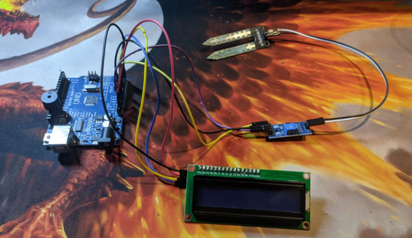
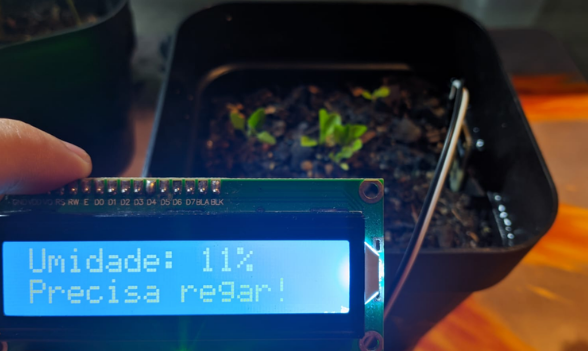
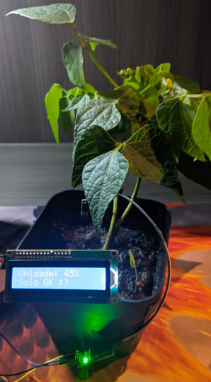

# 🌱 FloraTech – Vaso Inteligente com Arduino

Este projeto faz parte da oficina **FloraTech**, que une **tecnologia, robótica educacional e sustentabilidade**.  
A ideia é construir um **vaso inteligente** que usa **sensores de umidade do solo** para indicar quando a planta (no caso, o **algodão**) precisa de água.  

---

## 🚀 Funcionalidades

- Mede a umidade da terra com **2 sensores**.  
- Mostra no **display LCD I2C 16x2** a porcentagem de umidade e o estado do solo:  
  - `AL` → solo seco (alarme).  
  - `OK` → solo dentro da faixa ideal (40–60%).  
  - `UM` → solo muito úmido (>60%).  
- Emite **alertas sonoros** com o **buzzer no pino 11**:  
  - 1 beep = Sensor 1 está pedindo água.  
  - 2 beeps = Sensor 2 está pedindo água.  
  - 3 beeps = Ambos estão secos.  

---

## 🛠️ Materiais necessários

- 1x **Arduino Uno R3** (ou compatível)  
- 2x **Sensores de umidade do solo analógicos**  
- 1x **Display LCD 16x2 com módulo I2C**  
- 1x **Buzzer ativo** (digital)  
- Jumpers e protoboard  
- Cabo USB para ligar o Arduino ao computador  
- 1x **Vaso com algodão plantado** 🌾  

---

## 📌 Conexões

| Componente         | Pino no Arduino |
|--------------------|-----------------|
| Sensor de umidade 1 | A0              |
| Sensor de umidade 2 | A1              |
| Buzzer             | D11             |
| LCD SDA            | A4              |
| LCD SCL            | A5              |

⚠️ **Atenção:**  
- O LCD com módulo I2C já usa SDA (A4) e SCL (A5), então você só precisa ligar **4 fios**: VCC, GND, SDA e SCL.  
- Se o display não acender, pode ser que o endereço seja `0x3F` em vez de `0x27`.  

---

## 📖 Tutorial Passo a Passo (para iniciantes)

### 1. Instale o Arduino IDE
- Baixe em: [https://www.arduino.cc/en/software](https://www.arduino.cc/en/software).  
- Instale no seu computador (Windows, Linux ou Mac).  

### 2. Conecte os componentes
- Coloque o **Arduino Uno** na protoboard.  
- Ligue cada sensor ao Arduino:
  - VCC → 5V  
  - GND → GND  
  - OUT → A0 (sensor 1) / A1 (sensor 2)  
- Ligue o **LCD I2C**:  
  - VCC → 5V  
  - GND → GND  
  - SDA → A4  
  - SCL → A5  
- Ligue o **buzzer**:  
  - Pino positivo → D11  
  - Negativo → GND  

### 3. Configure a IDE Arduino
- Abra o **Arduino IDE**.  
- Vá em **Ferramentas > Placa > Arduino Uno**.  
- Vá em **Ferramentas > Porta** e escolha a porta do seu Arduino.  

### 4. Instale a biblioteca do LCD
- No IDE, vá em **Sketch > Incluir Biblioteca > Gerenciar Bibliotecas**.  
- Procure por **LiquidCrystal I2C** e instale.  

### 5. Carregue o código
- Copie o arquivo `floraTech.ino` (deste repositório).  
- Cole no Arduino IDE.  
- Clique em **Upload** (seta para a direita).  

### 6. Teste
- Abra o **Serial Monitor** (Ctrl+Shift+M) para ver os valores de umidade.  
- Veja no **LCD** a porcentagem e o estado (`AL`, `OK`, `UM`).  
- Se o solo estiver seco, o **buzzer vai apitar**.  

---

## 🌾 Como funciona na prática

1. Plante **algodão** no vaso.  
2. Após regar, o sensor mostra valores altos de umidade (acima de 60%).  
3. Conforme a terra seca, a porcentagem cai.  
4. Se ficar **abaixo de 30%**, o buzzer apita e o LCD mostra `AL`.  
5. O ideal é manter o solo entre **40% e 60%**.  

---

## 📷 Exemplos visuais

 
 

---

## ✨ Créditos

Projeto desenvolvido por **Disraeli Michelangelo Rafael da Costa Filho**  e **Milena Soares Porto**
Oficina **FloraTech – IFPB / UFCG**  

---

## 📄 Licença

Este projeto é open-source sob a licença **MIT**.  
Use, modifique e compartilhe livremente.  
